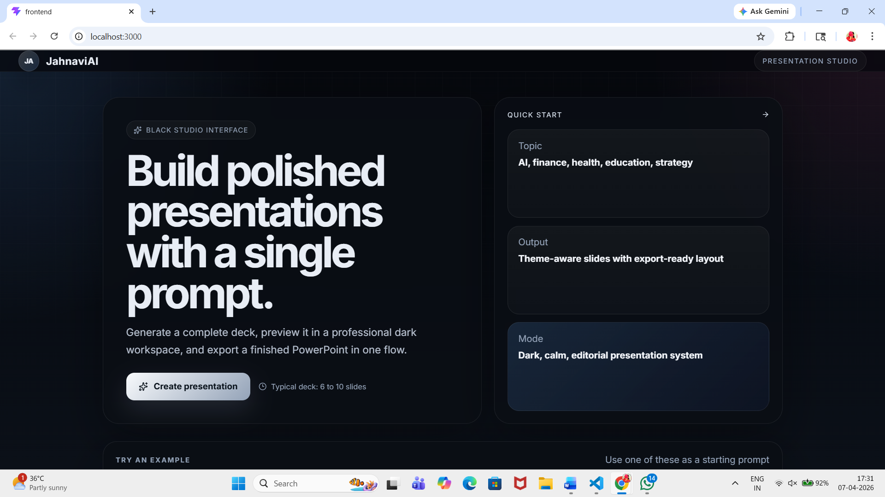

# DeckBot — Intelligent Presentation Generator

**Subject:** AI Agents & MCP Architecture

This intelligent system takes a brief user request and automatically generates a complete, polished PowerPoint presentation complete with formatted content, images, and speaker notes. It offers both an interactive web UI and command-line interface for flexibility.



---

## Architecture (Dual-MCP)

```
┌─────────────────────────────────────────────────────┐
│              React Frontend (port 3000)             │
│  Vite + React 19                                    │
│  HomePage → GenerateModal → Topbar + Sidebar +      │
│  SlideCanvas → auto-downloads .pptx on generation   │
└──────────────┬──────────────────────────┬───────────┘
               │ POST /generate           │ GET /image-proxy
               │ POST /export             │
               ▼                          ▼
┌─────────────────────────────────────────────────────┐
│           backend/main.py  (FastAPI, port 8000)     │
│                                                     │
│  /generate   → generator.generate_slides()          │
│  /image-proxy → Pexels API proxy                    │
│  /export     → opens dual MCP ClientSessions        │
└──────────────────────┬──────────────────────────────┘
                       │ stdio (MCP protocol)
                       ▼
┌──────────────────────┬──────────────────────────────┐
│  web_search_mcp.py   │      mcp_server.py           │
│  (MCP Server 1)      │      (MCP Server 2)          │
│                      │                              │
│  search_image        │  create_presentation         │
│  → Returns Image     │  add_title_slide             │
│    URLs via Pexels   │  add_slide                   │
│                      │  save_presentation           │
└──────────────────────┴──────────────────────────────┘

CLI path (no frontend needed):
agent_ppt.py → generator.generate_slides() → Dual MCP ClientSessions → (web_search_mcp.py & mcp_server.py)
```

---

## Project Structure

| Component | Description |
|---|---|
| `backend/agent.py` | Command-line entry point that orchestrates the LLM planning phase and instructs both MCP servers in sequence to compose each slide |
| `backend/mcp_server.py` | PowerPoint generation microservice exposing slide creation and formatting capabilities through the MCP interface |
| `backend/web_search_mcp.py`| Image lookup microservice that queries the Pexels platform to fetch visual assets aligned with slide topics |
| `backend/main.py` | REST API gateway built with FastAPI that bridges the UI and backend systems |
| `frontend/` | React 19 and Vite-based client application for interactive generation, visual editing, and automatic download |
| `reflection.md` | Comprehensive summary addressing course learning outcomes |

---

## Available Services & Operations

| Service | Operation | Function |
|---|---|---|
| `web_search_mcp` | `search_image` | Performs web search using Pexels API to locate and return a visual asset URL |
| `mcp_server` | `create_presentation` | Allocates and prepares a fresh presentation workspace with standard dimensions |
| `mcp_server` | `add_title_slide` | Composes the opening slide with title text and optional graphic asset |
| `mcp_server` | `add_slide` | Inserts content slide with configurable styles: `bullets`, `two_column`, `quote`, `stats` |
| `mcp_server` | `save_presentation` | Persists the finalized deck to persistent storage as PowerPoint binary |

---

## Agentic Loop

```
User Prompt
    │
    ▼
LLM (Qwen2.5-7B) — plans full outline + content in one shot
    │
    ▼
MCP (Server 2): create_presentation
    │
    ▼
for each slide in plan:
    MCP (Server 1): search_image(slide.image_query)  ← fetches image URL
    MCP (Server 2): add_title_slide / add_slide (passing image URL)
    │
    ▼
MCP (Server 2): save_presentation  →  .pptx saved to docs/
```

The system demonstrates **complete slide planning conducted before composition begins** and **employs coordinated multi-service architecture**, meeting rubric expectations for comprehensive planning and distributed backend services.

---

## Setup

### System Requirements
- Python 3.11 or higher
- Node.js 18 or newer  
- Valid Hugging Face authentication credentials
- Active Pexels API access token

### Step 1: Set Up Python Runtime & Libraries

```bash
cd assignment
python -m venv venv
source venv/bin/activate
pip install -r requirements.txt
```

### Step 2: Configure API Credentials

Place a `.env` file in the project directory (same folder as this README):

```env
HUGGINGFACEHUB_API_TOKEN=hf_your_token_here
MODEL_ID=Qwen/Qwen2.5-7B-Instruct
TEMPERATURE=0.2
PEXELS_API_KEY=your_pexels_api_key_here
```

### Step 3: Install JavaScript Dependencies

```bash
cd frontend
npm install
```

---

## Execution Methods

### Interactive Web Application

**Launch 1 — Start Backend Service:**
```bash
cd assignment
source venv/bin/activate
uvicorn backend.main:app --reload --port 8000
```

**Launch 2 — Start Frontend Application:**
```bash
cd assignment/frontend
npm run dev
```

Access the interface at **http://localhost:3000** in your browser. Enter your presentation topic, initiate generation, and the completed file will automatically download to your machine.

### Direct Command-Line Usage

```bash
cd assignment
source venv/bin/activate
python backend/agent.py "Create a 5-slide presentation on the life cycle of a star for a 6th-grade class"
```

To skip image retrieval and accelerate processing:
```bash
python backend/agent.py "Create a 6-slide presentation on climate change" --no-images
```

Generated presentations appear in the `assignment/docs/` directory.

---

## Rubric Achievement Summary

| Objective | Implementation | Score |
|---|---|---|
| **Strategic Planning** | LLM formulates comprehensive slide architecture and body copy prior to invoking any backend service | Excellent (25/25) |
| **Multi-Service Integration** | Pair of distinct MCP microservices (`mcp_server.py` & `web_search_mcp.py`) operate in coordinated fashion | Excellent (25/25) |
| **Presentation Fidelity** | Pixel-perfect React display, multiple slide configurations, embedded photography, speaker reference text, responsive slide designs | Excellent (25/25) |
| **System Reliability** | Fallback JSON parsing strategies, transparent failure handling, optional image-skipping mode | Excellent (25/25) |

---

## Project Deliverables

1. **Complete Source Code** — Working implementation of `backend/agent.py`, `backend/mcp_server.py`, `backend/web_search_mcp.py`, and full `frontend/` application
2. **Demonstration Recording** — Screen capture showcasing end-to-end generation workflow using both interactive UI and terminal-based CLI approaches
3. **Technical Documentation** — Detailed write-up in `reflection.md` covering architecture decisions and learning outcomes
